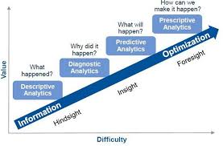

# Optimisation introduction
Crash course introduction to the field of optimisation and related fields.

# Background
A few colleagues were interested in furhter knowledge of optimisation (objective functions, constraints, etc.) and metaheurstics such as genetic algorithms.

# Outline
Plan to use basic intor/theory slides with some examples/tutorials in R/python pakcages, so far, for the following sections: 
- Predictive vs prescriptive analytics and how optimisation and machine learning fits into them
- Linear and non-linear formulations of single-objective optimisation problems and mathematical programming techniques (linear programming, etc.) to solve them. 
- Explosion of combinatorial optimisation
- Metaheuristics
- Multi-objective optimisation

## Analytics landscape

  
\[[Mathworks](https://www.mathworks.com/content/dam/mathworks/mathworks-dot-com/company/events/conferences/matlab-computational-finance-conference-nyc/2015/proceedings/predictive-modeling-techniques-insurance.pdf)]

  
\[[competitive-advantage-with-optimization](https://www.slideshare.net/AnwarAliMohamed/competitive-advantage-with-optimization-mii), 
[Business Analytics and Performance Management](https://pure.au.dk/portal/files/113728189/Working_paper_BA_and_Man_Acc_Final_2017.pdf)]

### Descriptive analytics

### Predictive analytics

### Prescriptive analytics

### Machine learning vs optimisation

