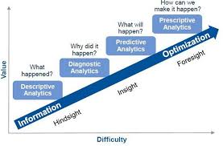
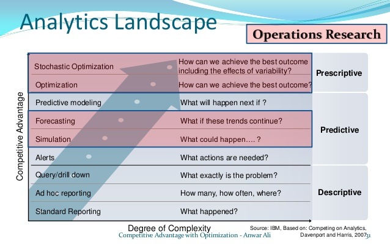
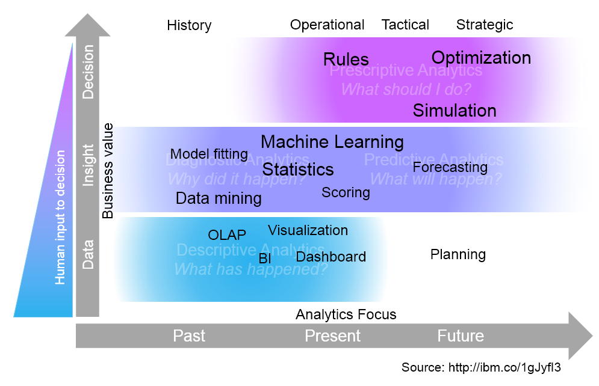

Let's first explain how optimisation fits into analytics, what it entails and what it does not.

\[[Mathworks](https://www.mathworks.com/content/dam/mathworks/mathworks-dot-com/company/events/conferences/matlab-computational-finance-conference-nyc/2015/proceedings/predictive-modeling-techniques-insurance.pdf)]

\[[competitive-advantage-with-optimization](https://www.slideshare.net/AnwarAliMohamed/competitive-advantage-with-optimization-mii), 
[Business Analytics and Performance Management](https://pure.au.dk/portal/files/113728189/Working_paper_BA_and_Man_Acc_Final_2017.pdf)]

\[[IBM: Analytics landscape](https://www.ibm.com/developerworks/community/blogs/jfp/entry/Analytics_Models?lang=en)]

## Descriptive analytics

## Predictive analytics

## Prescriptive analytics

### Machine learning and optimisation
\[[IBM: Machine Learning As Prescriptive Analytics](https://www.ibm.com/developerworks/community/blogs/jfp/entry/Machine_Learning_As_Prescriptive_Analytics?lang=en)]

> One thing we did in the past was to use CPLEX quadratic solver to compute support vector machines.  When we did it we blew away all approaches coming from machine learning as CPLEX was several orders of magnitude faster.  It supports the claim by John Mount that lots of machine learning work does not leverage state of the art optimization techniques.  I'd be interested in revisiting the SVM topic now, given both sides (optimization and machine learning) have made significant progress, and given problem sizes have increased significantly.  
\[[IBM: Machine Learning and Optimization](https://www.ibm.com/developerworks/community/blogs/jfp/entry/machine_learning_and_optimization1?lang=en)]
